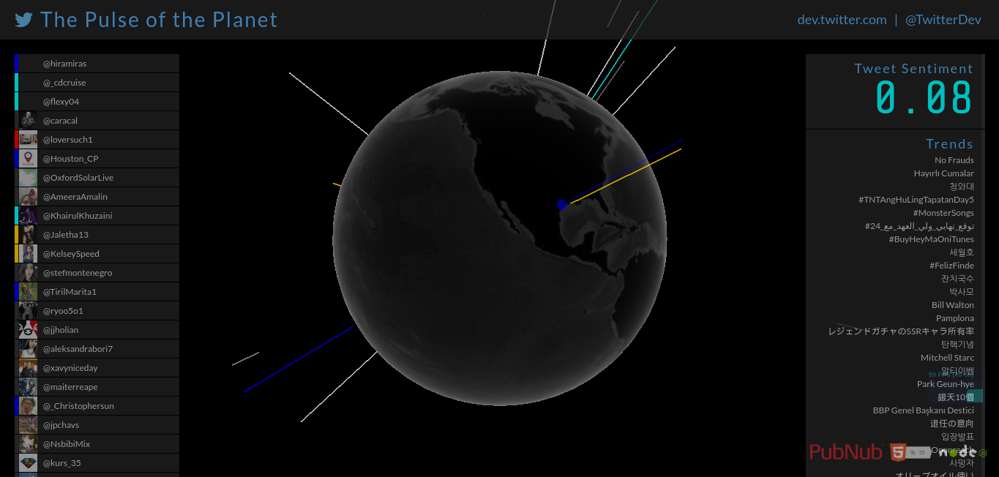
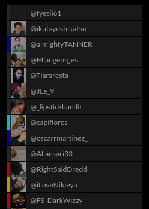
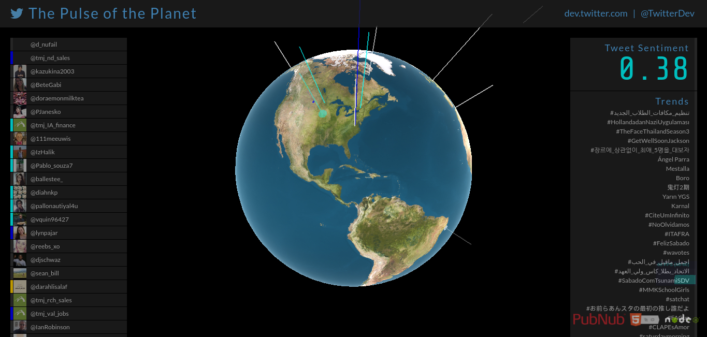
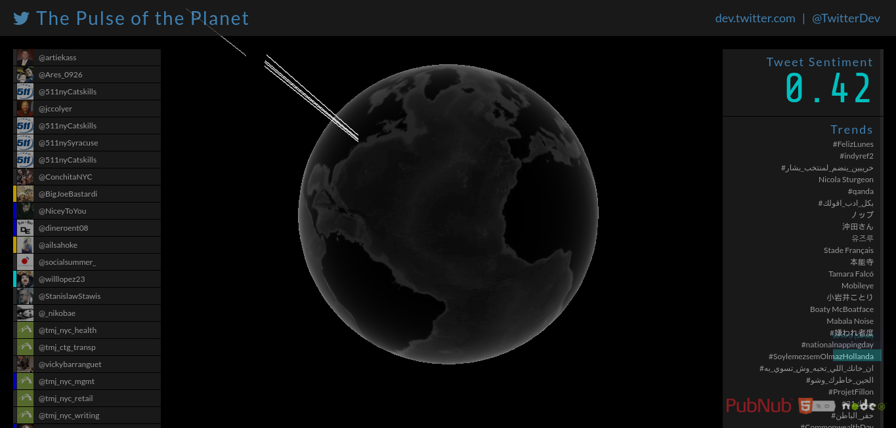
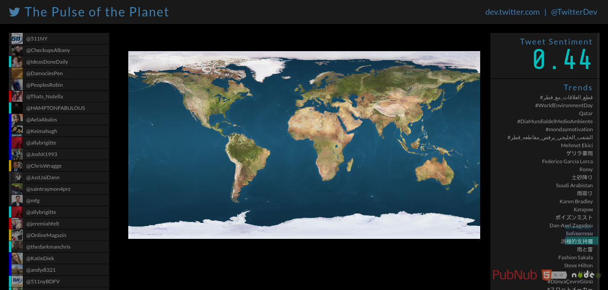
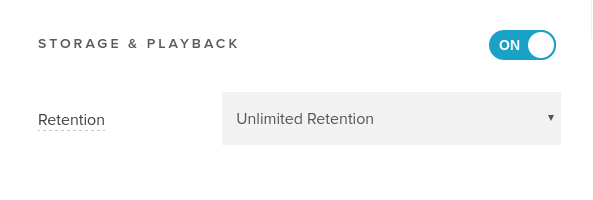

# Ιόνιο Πανεπιστήμιο - Τμήμα Πληροφορικής

## Κινητά και Κοινωνικά Μέσα

## Twitter Sentiment Analysis

**Γιώργος Μαργαρίτης ΑΜ Π2015139**

## Τελική Αναφορά

### Διεύθυνση για την εφαρμογή

[https://radiant-bastion-22660.herokuapp.com/](https://radiant-bastion-22660.herokuapp.com/)

### Σύνοψη

Η εργασία είχε ως στόχο την πραγματοποιήση διάφορων αλλαγών πάνω σε ένα ήδη διαμορφωμένο open source κώδικα μιας real-time εφαρμογής που βρίσκεται στο GitHub. Για τις αλλαγές αυτές δώθηκαν οδηγίες στο πλαίσιο του μαθήματος.

### Εισαγωγή

Η εφαρμογή στην οποία βασίστηκε η εργασία συλλέγει διάφορα tweets από το Twitter και τα αναπαριστά με χρωματιστές ακτίνες(beams) πάνω σε μια 3D υδρόγειο. Τα χρώματα των ακτίνων καθορίζονται ανάλογα με το "βάρος" των λέξεων από τις οποίες απαρτίζονται τα tweets. Οι αλλαγές που πραγματοποιήθηκαν στο κώδικα αλλά και οι διάφορες μεταφράσεις περιγράφονται παρακάτω.

### Εργαλεία

Οι αλλαγές πραγματοποιήθηκαν πάνω σε ένα forked repository στη πλατφόρμα GitHub. Το hosting και το deployment έγιναν μέσω του Heroku στο οποίο δόθηκαν και τα keys/tokens από το Twitter και το PubNub. Το PubNub χρησιμοποιήθηκε επίσης για την αποθήκευση των δεδομένων σε server.

## Παραδοτέο 1

Κατά το παραδοτέο 1 , δηλώθηκαν οι αλλαγές που πραγματοποιήθηκαν στα επόμενα παραδοτέα σχετικά με τα χρώματα των ακτίνων(beams) αλλά και με τις λέξεις που μεταφράστηκαν.

### Διαβαθμίσεις χρωμάτων

* Έντονα θετικό συναίσθημα: Μπλε

* Θετικό συναίσθημα: Γαλάζιο

* Αρνητικό συναίσθημα: Πορτοκαλί

* Έντονα αρνητικό συναίσθημα: Κόκκινο

### Λέξεις που θα μεταφραστούν

abusing, abusive, destroy, selfish, terror, torture, trauma, treason, terrorist, terrorists, unbelievable, undecided, unemployment, unemployed, unfair, wrong, sweet, supporter, support, solve, solution, solutions, smart, secure, praise, popular, popularity, pleasure, pleasurable, joy, joyful, impressed

**Θα γίνει αλλαγή στην υφή της υδρογείου**

**Θα μειωθεί η ταχύτητα περιστροφής της**

**Θα περιοριστεί η περιοχή προέλευσης των tweets**

**Ενδέχεται να υπάρξουν περαιτέρω αλλαγές για καλύτερη βαθμολόγηση**

## Παραδοτέο 2

Στο παραδοτέο 2 υλοποιήθηκαν οι προαναφερόμενες αλλαγές.

### Υλοποιήθηκε η διαβάθμιση των χρωμάτων όπως δηλώθηκε στο Παραδοτέο 1

* Έντονα θετικό συναίσθημα: Μπλε

* Θετικό συναίσθημα: Γαλάζιο

* Αρνητικό συναίσθημα: Πορτοκαλί

* Έντονα αρνητικό συναίσθημα: Κόκκινο

**Link:** [TweetBeacon.js](https://github.com/gmargaritis/twitter-stream-globe/blob/%CE%A0%CE%B1%CF%81%CE%B1%CE%B4%CE%BF%CF%84%CE%AD%CE%BF-2-/-%CE%91%CE%BB%CE%BB%CE%B1%CE%B3%CE%AE-%CE%A7%CF%81%CF%89%CE%BC%CE%AC%CF%84%CF%89%CE%BD/public/javascripts/TweetBeacon.js)

### Πραγματοποιήθηκε αλλαγή αντστοίχων χρωμάτων στην αριστερή στήλη και στο score

**Links:**
* [TweetHud.js](https://github.com/gmargaritis/twitter-stream-globe/blob/%CE%A0%CE%B1%CF%81%CE%B1%CE%B4%CE%BF%CF%84%CE%AD%CE%BF-2-/-%CE%91%CE%BB%CE%BB%CE%B1%CE%B3%CE%AE-%CE%A7%CF%81%CF%89%CE%BC%CE%AC%CF%84%CF%89%CE%BD/public/javascripts/TweetHud.js)

* [style.css](https://github.com/gmargaritis/twitter-stream-globe/blob/%CE%A0%CE%B1%CF%81%CE%B1%CE%B4%CE%BF%CF%84%CE%AD%CE%BF-2-/-%CE%91%CE%BB%CE%BB%CE%B1%CE%B3%CE%AE-%CE%A7%CF%81%CF%89%CE%BC%CE%AC%CF%84%CF%89%CE%BD/public/stylesheets/style.css)

* [style.scss](https://github.com/gmargaritis/twitter-stream-globe/blob/%CE%A0%CE%B1%CF%81%CE%B1%CE%B4%CE%BF%CF%84%CE%AD%CE%BF-2-/-%CE%91%CE%BB%CE%BB%CE%B1%CE%B3%CE%AE-%CE%A7%CF%81%CF%89%CE%BC%CE%AC%CF%84%CF%89%CE%BD/public/stylesheets/style.scss)

### Λέξεις που μεταφράστηκαν

abusing (καταχρώμαι), abusive (καταχρηστικός , καταχρηστική), destroy (καταστρέφω), selfish (εγωιστής , εγωίστρια), terror (τρόμος), torture (βασανηστήριο), trauma (τραύμα), treason (προδοσία), terrorist (τρομοκράτης), terrorists (τρομοκράτες), unbelievable (απίστευτο), undecided (αναποφάσιστος , αναποφάσιστη), unemployment (ανεργία), unemployed (άνεργος , άνεργη), unfair (άδικο), wrong (λανθασμένος , λανθασμένη), sweet (γλυκός , γλυκιά , γλυκό), supporter (υποστηρικτής), support (υποστηρίζω), solve (λύνω), solution (λύση), solutions (λύσεις), smart (έξυπνος , έξυπνη , έξυπνο), secure (ασφαλής), praise (έπαινος), popular (δημοφιλής), popularity (δημοτικότητα), pleasure (ευχαρίστηση), pleasurable (απολαυστικός , απολαυστική , απολαυστικό), joy (χαρά), joyful (χαρούμενος , χαρούμενη), impressed (εντυπωσιασμένος , εντυπωσιασμένη)

**Link:** [AFINN-translateToGreek165.txt](https://github.com/gmargaritis/twitter-stream-globe/blob/%CE%A0%CE%B1%CF%81%CE%B1%CE%B4%CE%BF%CF%84%CE%AD%CE%BF-2-/-%CE%9C%CE%B5%CF%84%CE%AC%CF%86%CF%81%CE%B1%CF%83%CE%B7-%CE%9B%CE%AD%CE%BE%CE%B5%CF%89%CE%BD/AFINN-translateToGreek165.txt)

## Παραδοτέο 3

Δημιουργήθηκε το brach Final που περιέχει όλες τις μέχρι στιγμής αλλαγές.

Τα branch στα οποία πραγματοποιήθηκαν οι αλλαγές *προήλθαν* απο το branch που είχε γίνει η αλλαγή των χρωμάτων.

Έγιναν αλλαγές στην υφή της υδρογείου , στην ταχύτητα περιστροφής της αλλά και περιορίστηκε η περιοχή προέλευσης των tweets στη Νέα Υόρκη

### Επιτεύχθηκε αλλαγή στην υφή της υδρογείου

Προστέθηκε μια εικόνα της υδρογείου στο /public/images και έπειτα τέθηκε το σωστό path στο αρχείο TwitterStreamGlobe.js

**Links:**

* [TwitterStreamGlobe](https://github.com/gmargaritis/twitter-stream-globe/blob/61c6d682cffbec2dc1baf2a8784bbe31b83b5d38/public/javascripts/TwitterStreamGlobe.js#L61)

* [/public/images](https://github.com/gmargaritis/twitter-stream-globe/blob/%CE%A0%CE%B1%CF%81%CE%B1%CE%B4%CE%BF%CF%84%CE%AD%CE%BF-3-/-%CE%91%CE%BB%CE%BB%CE%B1%CE%B3%CE%AE-%CE%A5%CF%86%CE%AE%CF%82/public/images/world-map.jpg)

### Επιτεύχθηκε η μείωση της ταχύτητας της υδρογείου

**Link:** [TwitterStreamGlobe.js](https://github.com/gmargaritis/twitter-stream-globe/blob/218817a2964262d8f79c478c4b7480bd608852f9/public/javascripts/TwitterStreamGlobe.js#L166)

### Επιτεύχθηκε o περιορισμός της περιοχής προέλευσης των tweets

Έγινε αλλαγή στα longitude, latitude ζευγάρια σύμφωνα με το twitter API [1] ώστε τα εισερχόμενα tweets να προέρχονται μόνο από τη Νέα Υόρκη.

**Link:** [tweet-publisher/index.js](https://github.com/gmargaritis/twitter-stream-globe/blob/c7fb37ad94b8a61d3c6dbeca4dfd5063e98c6083/tweet-publisher/index.js#L36)

## Παραδοτέο 4

### Αλλαγή της απεικόνησης απο 3D σε 2D

Επιτεύχθηκε η αλλαγή της απεικόνησης της υδρογείου απο σφαίρα(3D) σε ένα επίπεδο χάρτη(2D). Σύμφωνα με τον οδηγό χρήσης του three.js [2] χρησιμοποιήθηκε ο τύπος "planeGeometry" αντί για το τύπο "sphereGeometry" ώστε να γίνει η μετατροπή στο επίπεδο.

Δυστυχώς δεν ήταν δυνατή η μετατροπή των ακτίνων(beams) από vector3 σε vector2 και έτσι δεν προσαρμόστηκαν πάνω στον επίπεδο χάρτη.

**Link:**[TwitterStreamGlobe.js](https://github.com/gmargaritis/twitter-stream-globe/blob/53bb8a421e52475f0d15d54f51a308e87e25a9c9/public/javascripts/TwitterStreamGlobe.js#L56)

### Αποθήκευση σε server

Μέσω της πλατφόρμας PubNub είναι δυνατή η αποθήκευση των δεδομένων σε έναν από τους server τους [3]. Ο χρήστης μπορεί επίσης να διαλέξει και το χρονικό διάστημα για το οποίο θα αποθηκευτούν τα δεδομένα.

Η απεικόνηση - ανάκτηση των δεδομένων μπορεί να γίνει με δύο τρόπους. Αρχικά μέσω του tab "Usage" στη πλατφόρμα του PubNub, στην οποία υπάρχουν γραφήματα αλλά και η επιλογή να κατεβάσει ο χρήστης ένα csv αρχείο με τα δεδομένα που έχουν καταγραφεί. Αλλίως μέσω της χρήσης του History API [4] [5] που προσφέρει το PubNub.

## Συμπεράσματα

Η εργασία αυτή βοήθησε στην εκμάθηση του workflow του Git αλλά και της πλατφόρμας του GitHub εφόσον χρειάστηκε να πραγματοποιηθούν pull requests προς το κεντρικό αποθετήριο της εργασίας. Παράλληλα μέσα από την έρευνα που πραγματοποιήθηκε για την υλοποίηση των ζητουμένων, δόθηκε η δυνατότητα για την απόκτηση περαιτέρω γνώσεων πάνω στη Javascript, το three.js, το τρόπο λειτουργίας του Geofence αλλά και του framework AngularJS.

## Bonus A

[https://gmargaritis.github.io/Final-Report/](https://gmargaritis.github.io/Final-Report/)

## Βιβλιογραφία

1 [Twitter API / Streaming API request parameters / Locations](https://dev.twitter.com/streaming/overview/request-parameters#locations)

2 [ three.js/docs/PlaneGeometry](https://threejs.org/docs/index.html#api/geometries/PlaneGeometry)

3 [PubNub Storage and Playback](https://www.pubnub.com/products/storage-and-playback/)

4 [History API](https://www.pubnub.com/docs/tutorials/pubnub-storage-and-playback)

5 [PubNub AngularJS SDK](https://github.com/gmargaritis/twitter-stream-globe/tree/master/bower_components/pubnub-angular)
